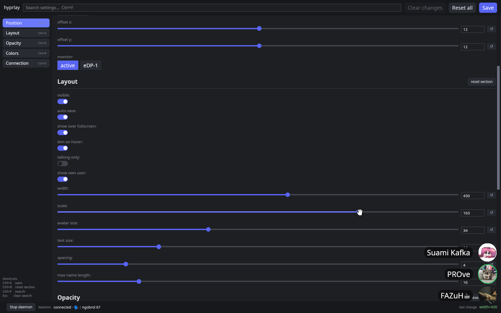
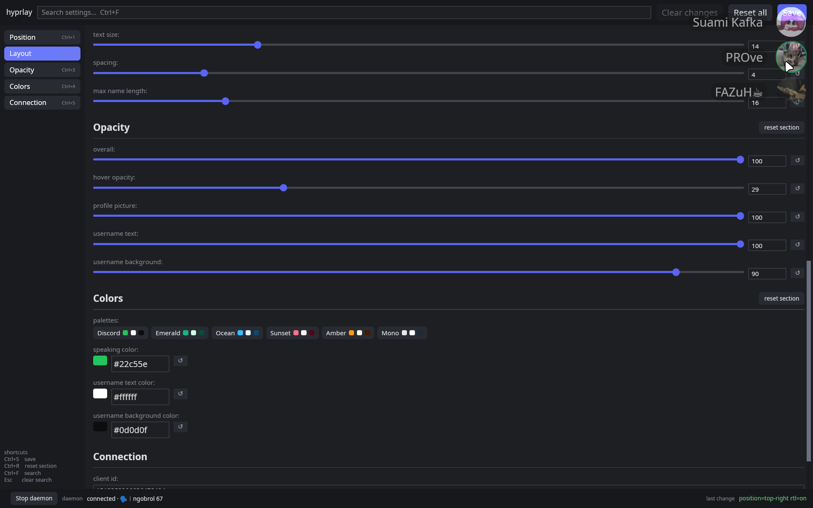
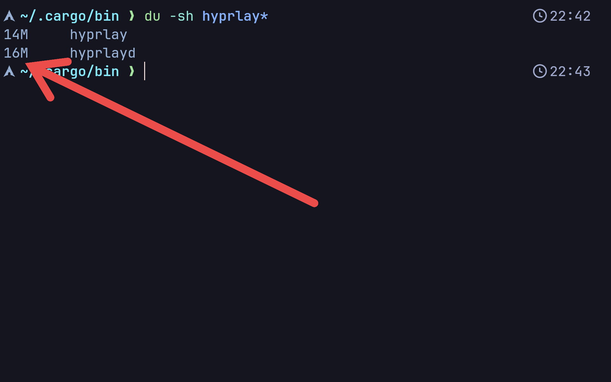
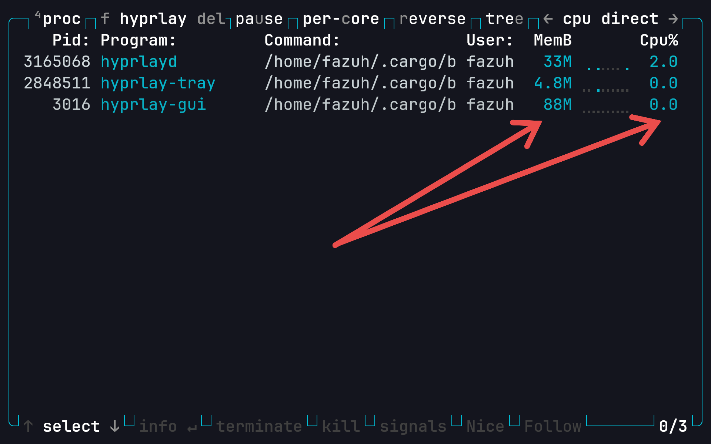

<h1 align="center">
  
  hyprlay
</h1>

<p align="center"><strong>Lightweight and highly configurable Discord voice overlay for Linux, MacOS and Windows</strong></p>

<hr>

<div align="center">
● <a href="#installation">⭐ Installation</a>  ● <a href="#preview">Preview</a>  ● <a href="#setup">⭐ Setup</a><br>
● <a href="#usage">Usage</a>  ● <a href="#documentation">Documentation</a>  ● <a href="#license">License</a>
</div>

## ⭐ Installation

Download the latest binaries from [releases page](https://github.com/FAZuH/hyprlay/releases/latest) and move both (`hyprlay`, `hyprlayd`) to a directory on your `$PATH` (e.g. `~/.local/bin`).

Or install with [Cargo](https://doc.rust-lang.org/cargo/getting-started/installation.html):
```sh
cargo install --git https://github.com/FAZuH/hyprlay

# Or build from source:
cargo build --release
# then copy target/release/hyprlay{,d} to $PATH
```

## Preview

<table>
<tr>
<td width="50%" valign="middle">

### Highly Configurable

Highly configurable overlay — position, anchors, offsets, size, spacing, opacity, palettes, and colors — from the GUI or `hyprlay set` to integrate with scripts or keybinds.

</td>
<td width="50%">
  
</td>
</tr>
<tr>
<td width="50%" valign="middle">

### Dim on Hover

Auto-dims to your chosen opacity the moment the cursor passes over the overlay.

</td>
<td width="50%">
  
</td>
</tr>
<td width="50%" valign="middle">

### Small

Total application size is only ≈30MB.

</td>
<td width="50%">
  
</td>
</tr>
<tr>
<td width="50%" valign="middle">

### Lightweight

Idles at a few percent CPU and tens of megabytes RAM.

</td>
<td width="50%">
  
</td>
</tr>
<tr>
</table>

## ⭐ Setup

1. Install the app with `hyprlay install`.
2. Follow [Token Exchange](docs/token-exchange.md) guide to connect your Discord account with the app.

## Usage

```sh
hyprlay gui                 # open settings — starts daemon
hyprlay status              # connection + config summary
hyprlay set position        # cycle screen corners
hyprlay set visible         # toggle roster visibility
hyprlay set monitor eDP-1   # move to output
hyprlayd                    # start overlay directly
```

See `hyprlay -h` and `hyprlay set -h` for all commands and keys.md) for Discord auth.

## Documentation

- [Token Exchange](docs/token-exchange.md) — connect hyprlay to your own Discord application
- [Code Layout](docs/dev/code-layout.md) — workspace layout, module interfaces, and layering rules
- [Debug Probes](docs/dev/debug-probes.md) — the `ipcprobe` / `wsprobe` examples for raw Discord RPC traffic
- [Changelog Guide](docs/dev/changelog.md) — Keep a Changelog style and scope grouping
- [Commit Scopes](docs/dev/commit-scopes.md) — allowed `type(scope)` values

## License

MIT
